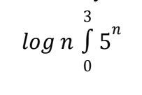
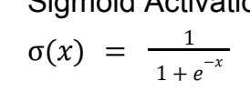
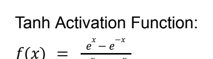
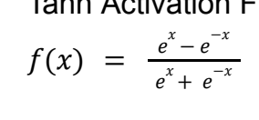

$$
3x^{2}+5y=6
$$

$$
\log n \int_{0} 5^{n}
$$

Sigmoid Activation Function:

$$
\mathrm{JNIIUIM}\neq\frac{1}{1}
$$

$$
\Pi\mathrm{arli}\ \mathrm{j}\ \mathrm{kctivation} \Gamma\mathrm{urcion}\mathrm{is}\hfill\mathrm{br}\hfill\mathrm{cr}
$$

Tanh Activation Function:

$$
{\mathrm{idilll}}\l{\mathrm{l}}\ s{\mathrm{l}}\mathrm{W}\mathrm{U}\mathrm{U}\l{\mathrm{I}}\Gamma
$$